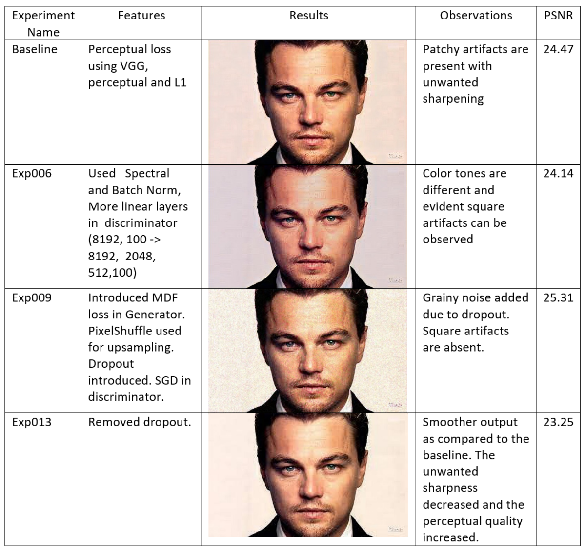
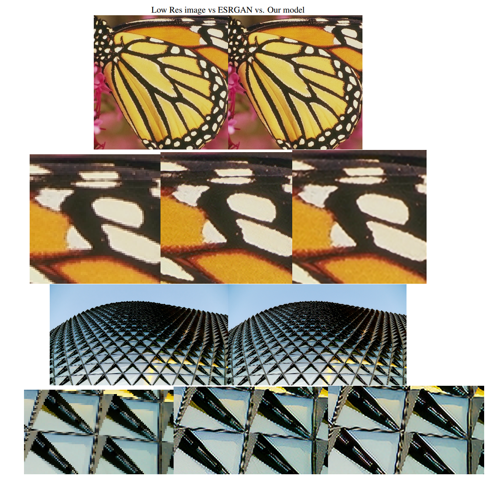
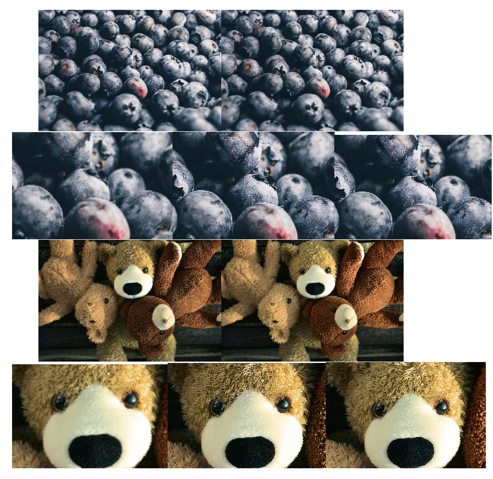

# Improved Enhanced Super-Resolution Generative Adversarial Networks for Image Super Resolution

Image Super-Resolution refers to the conversion of a low-resolution image to a high-resolution image. In this
project, the implementation of ESRGAN is chosen as the baseline to generate a super-resolved image. Multiple experiments
are then performed to improve upon the results from the baseline and also improve the stability of the GAN while training. It
is found that when the baseline is modified to have a different set of losses and other normalizations to stabilize the training,
the perceptual quality increases.

## Dataset

For our training dataset, we use DIV2K. This has 800 high definition high
resolution images collected from the Internet. The low-resolution images are generated using bicubic interpolation with
downsampling factor of 4 and Gaussian blur.

Download the dataset: [DIV2K Dataset](https://data.vision.ee.ethz.ch/cvl/DIV2K/)

## Test
#### Dependencies
- Python 3
- Install the dependencies in requirements.txt

### Test models
1. Clone this github repo.
```
git clone https://github.com/williamcfrancis/Super-Resolution-with-Improved-ESRGAN.git
cd Super-Resolution-with-Improved-ESRGAN
```
2. Place your own **low-resolution images** in `./LR` folder.
3. Pretrained model weights are present in './weights' folder
4. Run validate.
```
python validate.py
```
5. The results are in `./results` folder.

## Train
#### Dependencies
- Python 3
- Install the dependencies in requirements.txt

### Train models
1. Clone this github repo
```
git clone https://github.com/williamcfrancis/Super-Resolution-with-Improved-ESRGAN.git
cd Super-Resolution-with-Improved-ESRGAN
```
2. Run dataset.py to prepare the datasets.
3. Run train
```
python train.py
```

## Experiments carried out on the ESRGAN baseline



## Results

The following images show the comparison of the Low resolution images, images generated using our baseline model ESRGAN and our final model. The LR images are on the left, ESRGAN outputs are in the middle and our model outputs are on the right. The major difference between the performance of our model and the baseline is that it
generates excessively sharp images which is undesirable as it decreases the perceptual quality of the image. Instead, our model produces smoother images which are more appealing to the human eye and do not look very cartoon-like. The images generated from our model resemble the real life images more closely than the baseline.



